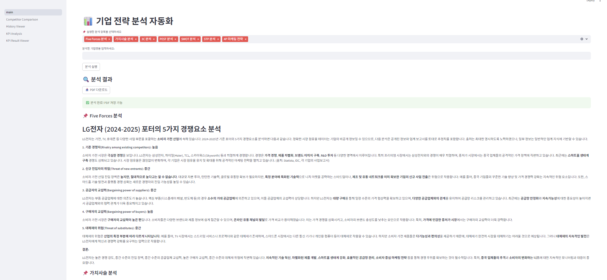
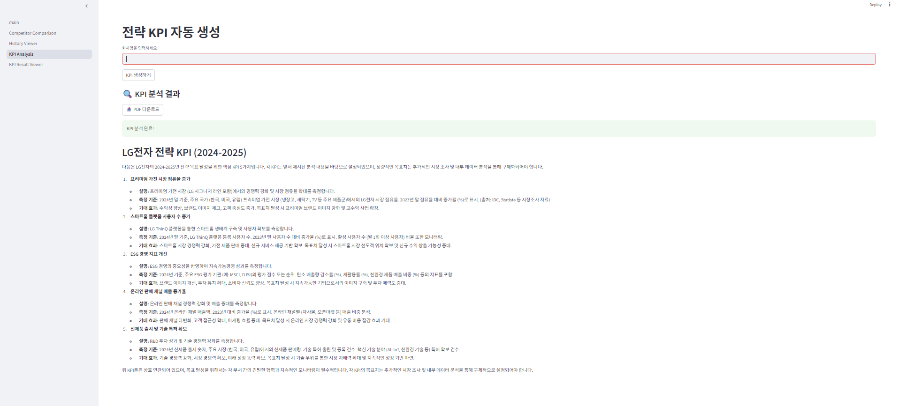
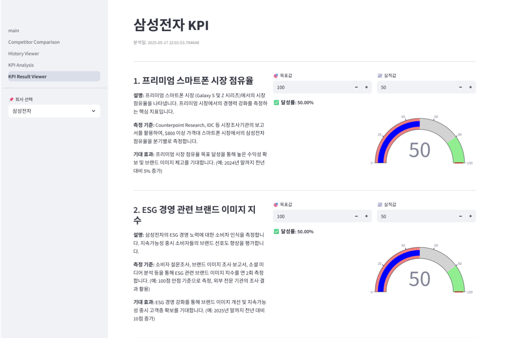
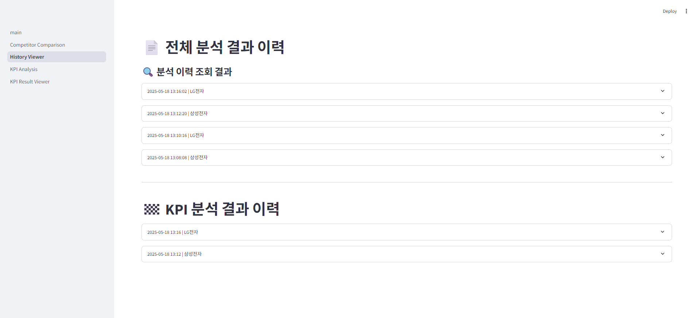
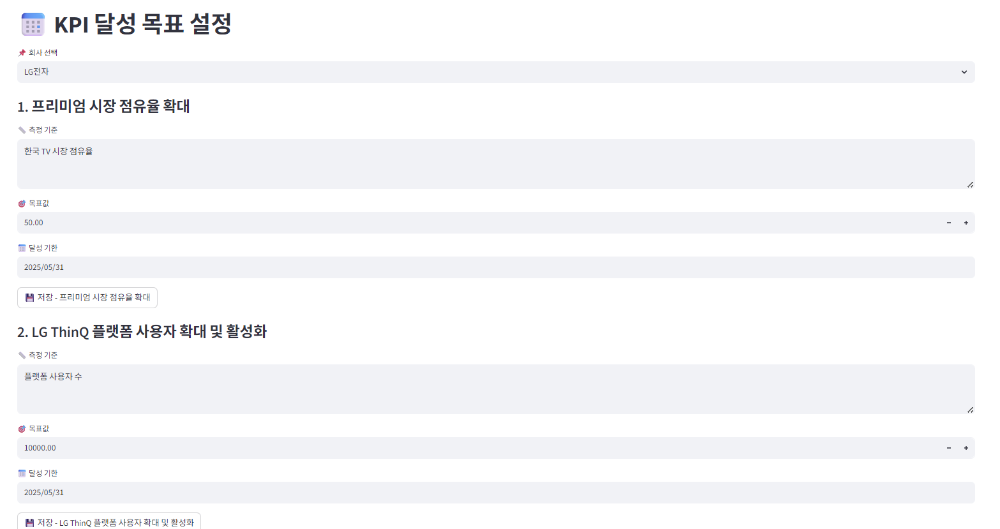
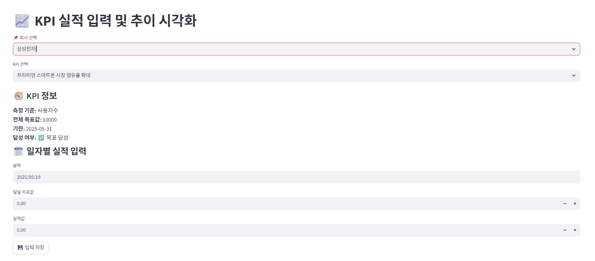
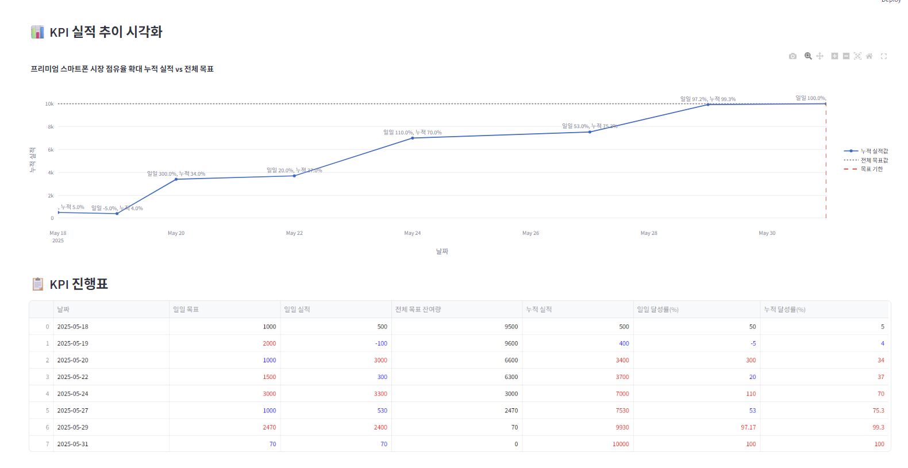

# 📊 전략 분석 자동화 시스템 (AI Strategy Analyzer)

## 🔍 개요

이 프로젝트는 사용자가 **기업명을 입력하고 (향후 추가 예정)전략 분석 항목을 선택**하면, Google Gemini API를 활용해 다음과 같은 전략 분석을 자동으로 수행하고 결과를 PDF로 저장 및 조회할 수 있는 **Streamlit 기반 웹 애플리케이션**입니다. 여러 전략 분석, KPI 생성 및 대시보드 관리, 이전 이력 조회 기능이 있습니다.

## 🚀 실행 결과 화면
1. **main.py 결과 화면(전략 분석)**



2. **KPI_Analysis.py 결과 화면(KPI 분석)**



3. **KPI_Result_Viewer.py 결과 화면(KPI 대시보드: 단일)**



4. **History_Viewer.py 결과 화면(조회 이력 관리)**



5. **KPI_Deadline_Manager.py & KPI_Progress_Traker.py 결과 화면(KPI 시계열 조회 대시보드)**






## 🚀 실행 방법
1. 가상환경 설치
```bash
py -3.12 -m venv .venv
```
2. 가상환경 접속 후 requirements.txt를 통한 설치
```bash
.\.venv\Scripts\activate
pip install -r requirements.txt
```
3. .env 파일 생성 및 Key, URL입력
```
GEMINI_API_KEY = Your Key
GEMINI_URL = "URL"
```
4. 실행(가상환경 접속 후)
```bash
streamlit run main.py
```

---

## ⚙️ 주요 기능

1. ✅ **선택한 분석 항목 기반 전략 분석 실행**
2. 🧠 **Gemini API 기반 GPT 분석**:
   - Five Forces 분석
   - 가치사슬 분석
   - 3C, PEST, SWOT, STP 분석
   - 4P 마케팅 전략
   - KPI 분석
3. 📄 **PDF 저장 기능**:
   - 분석 결과를 Markdown 스타일로 PDF 저장
   - 요약 및 키워드 자동 생성 포함
4. 🗃️ **SQLite 기반 분석 이력 저장 및 조회**
   - 조회일, 기업명, 분석 항목, 요약, 키워드, PDF 다운로드 제공
   - 각 분석, KPI 분석 결과 조회
   - KPI 대시보드(일일 검사)
   - KPI 대시보드(목표일, 측정값 등 시계열 차트)

---

## 📁 프로젝트 구조

- main.py: 메인 실행 파일
- modules/ : 기능 로직
   + analyzer.py: 분석 로직
   + db.py: SQLAlchemy 기반 DB 저장/조회 모듈
   + gemini_api.py: gemini 연결
   + history.py: 이력 저장
   + prompts_loader.py: 프롬프트 로더
   + kpi_dashboard.py: KPI_Result_Viewer 화면 로적
   + kpi_generator.py: KPI_Analysis 화면 로직
   + kpi_deadline_logic.py: KPI_Deadline_Manager.py 화면 로직
   + kpi_progress.db.py: KPI_Progress_Traker.py, KPI_Deadline_Manager.py에서 사용할 데이터 베이스 정의
   + global_alerts.py: KPI 마감기한 도래 시 알람 기능(개발중)
- pages/
   + History_Viewer.py: SQLAlchemy 연결하여 조회 기능
   + KPI_Analysis.py: KPI 분석 화면
   + KPI_Result_Viewer.py: KPI 대시보드 결과 화면(일일 조회)
   + KPI_Deadline_Manager.py: 목표값, 측정값, 마감 기한 설정
   + KPI_Progress_Traker.py: 일자별 KPI 관리
- prompts/ : 프롬프트 템플릿

## 📌 사용 기술
- Streamlit – 웹 인터페이스
- Google Gemini API – 전략 분석 텍스트 생성
- SQLite + SQLAlchemy – 분석 결과 저장 및 조회
- fpdf2 – PDF 생성 (한글 지원 포함)
- dotenv – 환경변수 관리